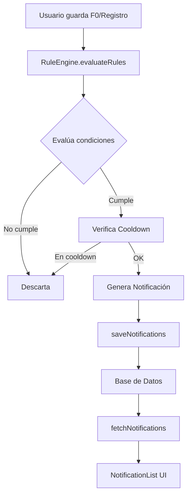

# Sistema de Notificaciones FertyFit - Documentación Completa

## Índice
1. [Visión General](#visión-general)
2. [Arquitectura del Sistema](#arquitectura-del-sistema)
3. [Motor de Reglas (RuleEngine)](#motor-de-reglas-ruleengine)
4. [Tipos de Notificaciones](#tipos-de-notificaciones)
5. [Reglas Activas](#reglas-activas)
6. [Interfaz de Usuario](#interfaz-de-usuario)
7. [Flujo de Datos](#flujo-de-datos)
8. [Configuración y Límites](#configuración-y-límites)
9. [Guía para el Equipo Médico](#guía-para-el-equipo-médico)

---

## Visión General

El sistema de notificaciones de FertyFit es un **motor de reglas determinístico** que genera notificaciones personalizadas basadas en:
- Datos del formulario F0 (ficha personal inicial)
- Registros diarios de la usuaria
- Patrones de comportamiento a lo largo del tiempo

**Objetivo:** Proporcionar feedback inmediato, educativo y motivacional a las usuarias en momentos clave de su ciclo y hábitos.

---

## Arquitectura del Sistema

### Componentes Principales



### Archivos Clave

| Archivo | Propósito |
|---------|-----------|
| [services/RuleEngine.ts](file:///Users/javiermkt/Documents/fertyfitapp/fertyfit-app/services/RuleEngine.ts) | Motor de reglas, lógica de evaluación y cooldowns |
| [components/NotificationSystem.tsx](file:///Users/javiermkt/Documents/fertyfitapp/fertyfit-app/components/NotificationSystem.tsx) | Componente UI de notificaciones |
| [App.tsx](file:///Users/javiermkt/Documents/fertyfitapp/fertyfit-app/App.tsx) | Integración y llamadas al RuleEngine |
| [types.ts](file:///Users/javiermkt/Documents/fertyfitapp/fertyfit-app/types.ts) | Definición de tipos TypeScript |

---

## Motor de Reglas (RuleEngine)

### Estructura de una Regla

Cada regla tiene los siguientes campos:

```typescript
{
  id: string,              // Identificador único (ej: 'F0-1', 'D-1')
  trigger: string[],       // Eventos que activan la regla
  type: string,           // Tipo de notificación
  priority: number,       // Prioridad (1=alta, 3=baja)
  cooldownDays: number,   // Días antes de poder volver a disparar
  condition: Function,    // Función que evalúa si se cumple
  getMessage: Function    // Función que genera título y mensaje
}
```

### Triggers (Eventos Disparadores)

| Trigger | Cuándo se dispara |
|---------|-------------------|
| `F0_CREATE` | Al crear el formulario F0 por primera vez |
| `F0_UPDATE` | Al actualizar el formulario F0 |
| `DAILY_LOG_SAVE` | Al guardar/actualizar un registro diario |
| `PERIODIC` | Evaluación periódica (no implementado aún) |

### Cooldown (Período de Enfriamiento)

**Propósito:** Evitar spam de notificaciones repetitivas.

- **cooldownDays = 0**: La regla puede disparar cada vez que se cumple la condición
- **cooldownDays = 3**: La regla solo puede disparar una vez cada 3 días
- **cooldownDays = 14**: La regla solo puede disparar una vez cada 14 días

**Implementación:** El sistema verifica en la base de datos si ya existe una notificación de esa regla dentro del período de cooldown. Si existe, no genera una nueva.

---

## Tipos de Notificaciones

Cada notificación tiene un `type` que determina su color y propósito:

| Tipo | Color | Icono | Uso |
|------|-------|-------|-----|
| `alert` | 🔴 Rojo | ⚠️ AlertCircle | Alertas importantes que requieren atención |
| `celebration` | 🟢 Verde | ✨ Sparkles | Celebrar logros y hábitos positivos |
| `opportunity` | 🟡 Ámbar | ⭐ Star | Oportunidades de mejora o ventanas fértiles |
| `insight` | 🟤 Beige | 💡 Bell | Insights educativos sobre patrones |
| `tip` | 🟤 Beige | 💡 Bell | Consejos prácticos |

---

## Reglas Activas

### Reglas F0 (Formulario Inicial)

#### F0-1: Revisión de Terreno Fértil
- **Condición:** BMI < 18.5 o BMI >= 30, y más de 12 meses intentando embarazo
- **Tipo:** Alert
- **Cooldown:** 0 días
- **Mensaje:** "Por tu peso actual y el tiempo que llevas buscando embarazo, tu terreno merece una revisión más detallada con tu especialista."

#### F0-2: Edad y Tiempo Buscando
- **Condición:** Edad >= 35 años y más de 12 meses intentando
- **Tipo:** Alert
- **Cooldown:** 0 días
- **Mensaje:** "Tienes más de 35 años y llevas más de un año intentando embarazo. Es un buen momento para revisar tu situación con tu especialista."

#### F0-3: Estrés Alto Crónico
- **Condición:** Nivel de estrés >= 4 en F0
- **Tipo:** Alert
- **Cooldown:** 0 días
- **Mensaje:** "Tu nivel de estrés es alto. El estrés crónico afecta tu ovulación. Vamos a trabajar en técnicas de gestión emocional."

#### F0-4: Descanso Insuficiente
- **Condición:** Horas de sueño promedio < 6
- **Tipo:** Alert
- **Cooldown:** 0 días
- **Mensaje:** "Tu descanso medio está por debajo de 6 horas. El sueño es una de las palancas más potentes para la ovulación."

### Reglas Diarias (DAILY_LOG_SAVE)

#### D-1: Sueño Muy Bajo
- **Condición:** Horas de sueño < 5
- **Tipo:** Alert
- **Cooldown:** 0 días
- **Mensaje:** "Hoy has dormido muy poco. Tu cuerpo va a necesitar más suavidad y menos exigencia hoy."

#### D-2: Pico de Estrés
- **Condición:** Nivel de estrés = 5
- **Tipo:** Alert
- **Cooldown:** 0 días
- **Mensaje:** "Has marcado un nivel de estrés muy alto. Te propongo que esta noche priorices el descanso mental."

#### D-3: Registro de Alcohol
- **Condición:** Consumo de alcohol = Sí
- **Tipo:** Alert
- **Cooldown:** 0 días
- **Mensaje:** "Hoy ha habido alcohol. Vigilar la frecuencia es importante para tu terreno fértil."

#### D-4: Objetivo de Agua
- **Condición:** Vasos de agua >= 6
- **Tipo:** Celebration
- **Cooldown:** 0 días
- **Mensaje:** "Hoy has llegado a tu objetivo de agua. Un gesto sencillo que ayuda a tu moco cervical."

#### D-5: Nutrición Fértil
- **Condición:** Porciones de vegetales >= 4
- **Tipo:** Celebration
- **Cooldown:** 1 día
- **Mensaje:** "Tu plato hoy ha sido muy fértil: buen nivel de vegetales y color."

#### D-6: Movimiento
- **Condición:** Minutos de actividad >= 30
- **Tipo:** Insight
- **Cooldown:** 1 día
- **Mensaje:** "Has dado movimiento a tu cuerpo hoy. El ejercicio moderado mejora la ovulación."

#### D-7: LH Positivo
- **Condición:** Test LH = Positivo
- **Tipo:** Opportunity
- **Cooldown:** 0 días
- **Mensaje:** "Hoy tu test de LH es positivo. Estás en tus días de máxima probabilidad de embarazo."

#### D-8: Moco Fértil
- **Condición:** Moco cervical = "Clara de huevo" o "Acuoso"
- **Tipo:** Opportunity
- **Cooldown:** 0 días
- **Mensaje:** "Tu moco cervical indica alta fertilidad. Tu cuerpo se prepara para ovular."

### Reglas de Ventana 3 Días

#### 3D-1: Constancia
- **Condición:** 3 registros consecutivos en los últimos 3 días
- **Tipo:** Celebration
- **Cooldown:** 7 días
- **Mensaje:** "Llevas 3 días seguidos registrando. La constancia es clave para conocer tu cuerpo."

#### 3D-2: Racha de Poco Sueño
- **Condición:** Promedio de sueño < 6h en últimos 3 días
- **Tipo:** Alert
- **Cooldown:** 7 días
- **Mensaje:** "Llevas 3 días con poco sueño. Tu cuerpo necesita recuperación para ovular bien."

### Reglas de Ventana 7 Días

#### 7D-1: Semana Completa
- **Condición:** 7 registros en los últimos 7 días
- **Tipo:** Celebration
- **Cooldown:** 14 días
- **Mensaje:** "¡Una semana completa de registros! Esto es un hito importante en tu camino."

#### 7D-2: Semana de Poco Sueño
- **Condición:** Promedio de sueño < 6.5h en últimos 7 días
- **Tipo:** Alert
- **Cooldown:** 14 días
- **Mensaje:** "Tu promedio de sueño esta semana es bajo. Prioriza el descanso para mejorar tu fertilidad."

---

## Interfaz de Usuario

### Ubicación de las Notificaciones

#### Dashboard
- **Muestra:** Solo notificaciones **no leídas**
- **Comportamiento:** Al marcar como leída, desaparece del Dashboard
- **Propósito:** Mostrar alertas y oportunidades inmediatas

#### Perfil
- **Muestra:** **Todas** las notificaciones (leídas y no leídas)
- **Comportamiento:** Historial completo de notificaciones
- **Propósito:** Revisar el historial de feedback recibido

### Diseño del Componente

**Tarjeta Expandible Única:**
```
┌─────────────────────────────────────┐
│ 🔔 Notificaciones [3 nuevas]       ▼│
│ 7 totales                            │
├─────────────────────────────────────┤
│ ⚠️ Sueño Muy Bajo              • ✕  │
│    Hoy has dormido muy poco...      │
│    26/11/24 - 14:26  [Marcar leída] │
├─────────────────────────────────────┤
│ ✨ Objetivo de Agua              ✕  │
│    Hoy has llegado a tu objetivo... │
│    26/11/24 - 15:10                 │
└─────────────────────────────────────┘
```

### Acciones del Usuario

| Acción | Efecto Dashboard | Efecto Perfil | Base de Datos |
|--------|------------------|---------------|---------------|
| **Marcar como leída** | Desaparece | Se queda visible, sin punto | `is_read = true` |
| **Borrar (X)** | Desaparece | Desaparece | `metadata.deleted = true` (soft delete) |

---

## Flujo de Datos

### 1. Usuario Guarda F0

```typescript
// App.tsx - handleSubmitForm()
const ruleNotifs = await evaluateRules('F0_CREATE', {
  user: user,
  submittedForms: [...submittedForms, newForm]
});
await saveNotifications(user.id, ruleNotifs);
await fetchNotifications(user.id);
```

### 2. Usuario Guarda Registro Diario

```typescript
// App.tsx - saveDailyLog()
const ruleNotifications = await evaluateRules('DAILY_LOG_SAVE', {
  user: user,
  currentLog: formattedLog,
  recentLogs: updatedLogs.data.map(mapLogFromDB)
});
await saveNotifications(user.id, ruleNotifications);
await fetchNotifications(user.id);
```

### 3. Evaluación de Reglas

```typescript
// RuleEngine.ts - evaluateRules()
for (const rule of applicableRules) {
  // 1. Evaluar condición
  const conditionMet = rule.condition(context);
  
  if (conditionMet) {
    // 2. Verificar cooldown
    const inCooldown = await checkCooldown(rule.id, userId, rule.cooldownDays);
    
    if (!inCooldown) {
      // 3. Generar notificación
      const { title, message } = rule.getMessage(context);
      newNotifications.push({...});
    }
  }
}
```

### 4. Soft Delete (Borrado Suave)

**¿Por qué soft delete?**
- Preserva el historial para el cooldown
- Permite análisis de datos posteriores
- Evita que la misma notificación se regenere inmediatamente

```typescript
// App.tsx - deleteNotification()
const newMeta = { ...(current?.metadata || {}), deleted: true };
await supabase.from('notifications').update({ metadata: newMeta }).eq('id', notifId);
```

```typescript
// App.tsx - fetchNotifications()
const activeNotifications = data.filter(n => !n.metadata?.deleted);
setNotifications(activeNotifications);
```

---

## Configuración y Límites

### Límites Actuales

| Parámetro | Valor | Ubicación |
|-----------|-------|-----------|
| **Límite diario** | 30 notificaciones/día | `RuleEngine.ts:493` |
| **Cooldown F0** | 0 días (dispara siempre) | Reglas F0-1 a F0-4 |
| **Cooldown Daily** | 0-1 días (según regla) | Reglas D-1 a D-8 |
| **Cooldown 3D** | 7 días | Reglas 3D-1, 3D-2 |
| **Cooldown 7D** | 14 días | Reglas 7D-1, 7D-2 |

### Ajustar Límite Diario

Para cambiar el límite diario de notificaciones:

```typescript
// services/RuleEngine.ts - línea 493
const limit = 30; // Cambiar este número
```

### Ajustar Cooldown de una Regla

```typescript
// services/RuleEngine.ts
{
  id: 'D-1',
  trigger: ['DAILY_LOG_SAVE'],
  type: 'alert',
  priority: 1,
  cooldownDays: 0, // Cambiar este número
  // ...
}
```

---

## Guía para el Equipo Médico

### ¿Qué Notificaciones Ven las Usuarias?

Las usuarias reciben notificaciones automáticas basadas en:

1. **Datos de su ficha inicial (F0)**
   - Edad, IMC, tiempo intentando embarazo
   - Hábitos de sueño y estrés reportados

2. **Registros diarios**
   - Horas de sueño cada noche
   - Nivel de estrés diario
   - Consumo de alcohol
   - Hidratación y nutrición
   - Biomarcadores (LH, moco cervical)

3. **Patrones a lo largo del tiempo**
   - Constancia en el registro
   - Tendencias de sueño
   - Rachas de buenos hábitos

### Tipos de Feedback

| Tipo | Propósito Médico | Ejemplo |
|------|------------------|---------|
| **Alert** | Señalar factores de riesgo o hábitos nocivos | "Tu nivel de estrés es muy alto" |
| **Celebration** | Reforzar hábitos positivos | "¡Una semana completa de registros!" |
| **Opportunity** | Indicar ventanas fértiles | "Tu test LH es positivo" |
| **Insight** | Educar sobre patrones | "El ejercicio moderado mejora la ovulación" |

### Cómo Agregar una Nueva Regla

**Ejemplo:** Queremos notificar si la usuaria tiene más de 3 días con estrés alto.

```typescript
// services/RuleEngine.ts - Agregar al array RULES
{
  id: '3D-3',
  trigger: ['DAILY_LOG_SAVE'],
  type: 'alert',
  priority: 1,
  cooldownDays: 7,
  condition: ({ recentLogs }) => {
    if (!recentLogs || recentLogs.length < 3) return false;
    const last3 = recentLogs.slice(0, 3);
    return last3.every(log => log.stressLevel >= 4);
  },
  getMessage: () => ({
    title: 'Estrés Sostenido',
    message: 'Llevas 3 días con estrés alto. Considera técnicas de relajación o hablar con tu especialista.'
  })
}
```

### Mejores Prácticas para Reglas

1. **Cooldown apropiado:**
   - Alertas importantes: 0-3 días
   - Celebraciones: 7-14 días
   - Insights educativos: 14-30 días

2. **Mensajes claros y accionables:**
   - ✅ "Tu sueño es bajo. Prioriza 7-8 horas esta noche."
   - ❌ "Tu sueño no es óptimo."

3. **Prioridad:**
   - 1 = Alta (alertas médicas, ventanas fértiles)
   - 2 = Media (insights, oportunidades)
   - 3 = Baja (celebraciones, tips)

### Monitoreo y Análisis

Para analizar qué notificaciones reciben las usuarias:

```sql
-- Ver notificaciones más comunes
SELECT title, COUNT(*) as count
FROM notifications
WHERE created_at >= NOW() - INTERVAL '30 days'
GROUP BY title
ORDER BY count DESC;

-- Ver notificaciones por tipo
SELECT type, COUNT(*) as count
FROM notifications
WHERE created_at >= NOW() - INTERVAL '30 days'
GROUP BY type;

-- Ver usuarias con más notificaciones de alerta
SELECT user_id, COUNT(*) as alert_count
FROM notifications
WHERE type = 'alert'
  AND created_at >= NOW() - INTERVAL '30 days'
GROUP BY user_id
ORDER BY alert_count DESC;
```

---

## Preguntas Frecuentes

### ¿Por qué una usuaria no recibe notificaciones?

1. **Límite diario alcanzado:** Ya recibió 30 notificaciones hoy
2. **Cooldown activo:** La regla ya disparó recientemente
3. **Condición no cumplida:** Los datos no cumplen la condición de la regla
4. **Notificación borrada:** La usuaria borró notificaciones similares

### ¿Cómo desactivar una regla temporalmente?

Comentar la regla en `RuleEngine.ts`:

```typescript
// {
//   id: 'D-1',
//   trigger: ['DAILY_LOG_SAVE'],
//   // ... resto de la regla
// },
```

### ¿Las notificaciones borradas se regeneran?

**No.** El soft delete preserva el registro en la base de datos con `metadata.deleted = true`, lo que permite que el cooldown siga funcionando y evita regeneración.

---

## Resumen Técnico

- **Motor:** Sistema de reglas determinístico
- **Triggers:** F0_CREATE, F0_UPDATE, DAILY_LOG_SAVE
- **Tipos:** alert, celebration, opportunity, insight, tip
- **Cooldowns:** 0-14 días según regla
- **Límite:** 30 notificaciones/día
- **UI:** Tarjeta expandible única
- **Vistas:** Dashboard (no leídas), Perfil (todas)
- **Delete:** Soft delete para preservar cooldowns
- **Base de datos:** Supabase (tabla `notifications`)
